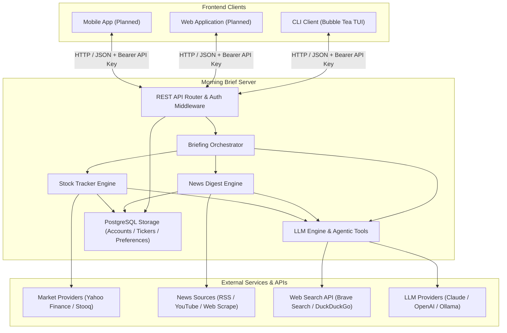
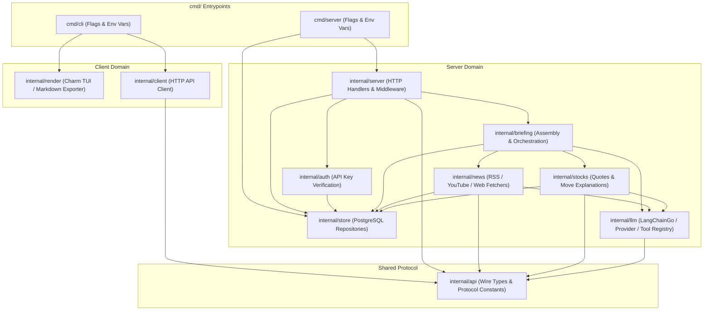
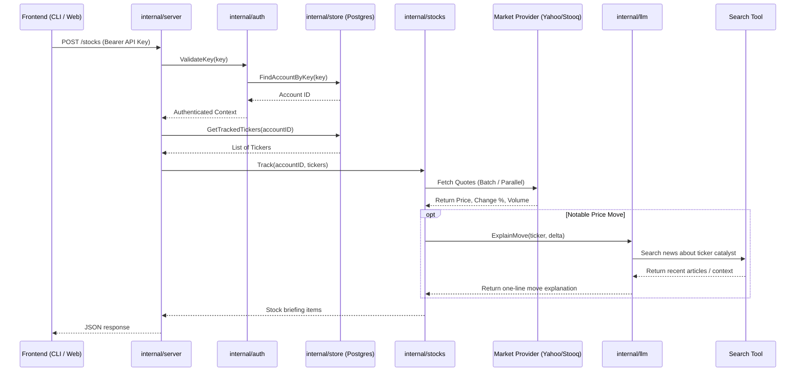
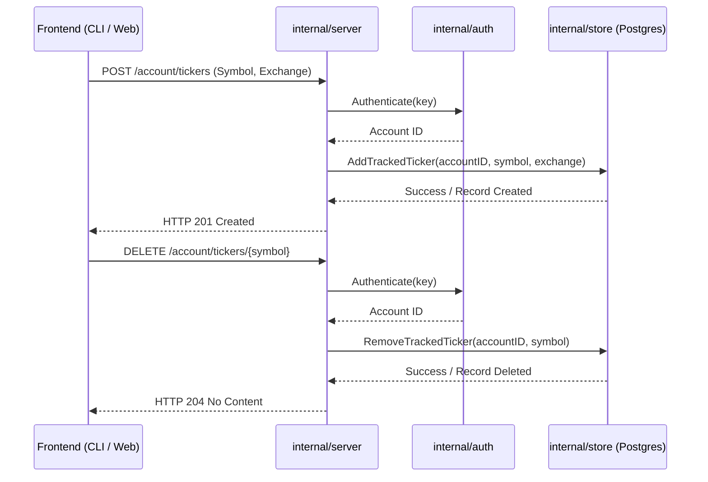
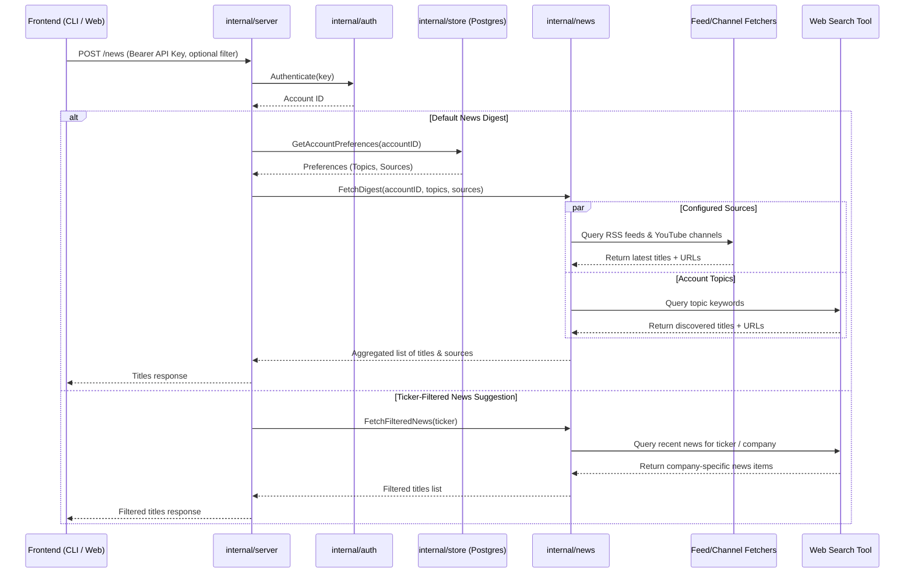
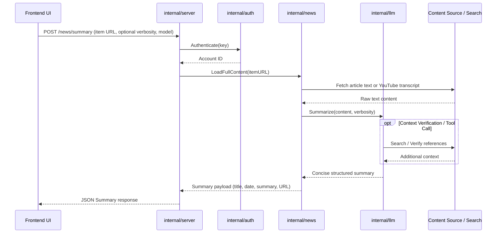
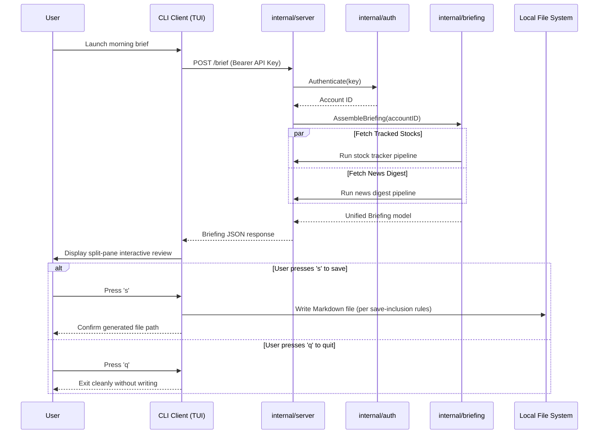
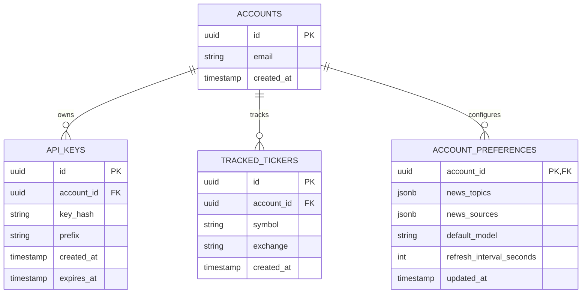
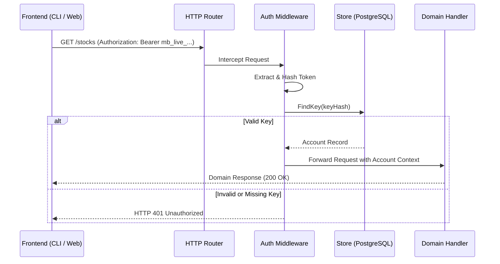

# Morning Brief — Software Architecture

This document defines the software architecture for Morning Brief, grounded in the product capabilities outlined in [docs/PRODUCT.md](PRODUCT.md).

> **Architectural Supersessions & Evolution**  
> To support multi-tenancy, clean operational boundaries, and multi-frontend consumption (CLI, Web, Mobile), this architecture updates several earlier product assumptions:
> 1. **Standalone Spawn Retired**: The server is always deployed and executed as an independent service. The client no longer auto-spawns or detects local server daemon child processes.
> 2. **PostgreSQL as Source of Truth**: Tracked financial tickers, news topics, enabled sources, and account preferences are persisted in PostgreSQL, replacing static YAML-based configurations.
> 3. **Account & API-Key Authentication**: Multi-tenant access is secured via long-lived opaque API keys (`Authorization: Bearer <key>`) evaluated by an authentication layer.
> 4. **No `internal/config` Package**: Configuration is read directly from environment variables and command-line flags within `cmd/server` and `cmd/cli` and passed explicitly to constructors.
> 5. **Endpoint Simplification**: Operational endpoint `POST /shutdown` and CLI command `server stop` are retired; process management is left to standard orchestration (systemd, Docker, Kubernetes). Operational endpoint `GET /healthz` is an open, unauthenticated liveness probe.

---

## 1. System Context & Overview

The server encapsulates all data persistence, external market retrieval, news ingestion, agentic tool workflows, and LLM orchestration behind an HTTP/JSON REST API. Frontend clients remain lightweight presentation layers responsible only for user interaction and local rendering.

### Architectural Principles

- **Independent Deployments**: The server runs as a standalone daemon or container. Clients (CLI, Web, Mobile) communicate across the network via authenticated HTTP/JSON requests.
- **Stateless Application Server**: Application server instances remain stateless; all persistent tenant states (tracked tickers, custom topics, feed preferences, cached summaries) live in PostgreSQL.
- **Unified Security Boundary**: Requests must present a valid API key, resolving the request to an authorized tenant account before domain logic executes.

---

## 2. Target Package Structure & Dependency Invariants

The Go codebase follows a strict acyclic dependency model to maintain modularity and high testability.

### Dependency Invariants
1. `internal/llm` defines the LLM provider interface and tool execution registry. It **never** imports `internal/news`, `internal/stocks`, or `internal/store`.
2. `internal/news` and `internal/stocks` import `internal/llm` for summarization and catalyst explanations, and `internal/store` for reading account configurations.
3. `internal/server` defines consumer interfaces (such as `BriefingGenerator`) implemented by `internal/briefing`, allowing isolated unit testing of handlers via test doubles.
4. `internal/auth` handles token parsing and identity resolution, querying `internal/store` to match keys to account identities.
5. `internal/api` contains pure DTO wire types and depends strictly on the standard library.
6. Neither `cmd/cli` nor `cmd/server` relies on a shared `config` package; each parses flags and environment variables directly and injects typed parameters into constructors.

---

## 3. Financial Product Tracking Architecture

The financial tracking subsystem (`internal/stocks`) manages user-selected tickers, fetches market movements (US equities, ETFs like VOO, and Thai SET indices), and stores tracked items in PostgreSQL.

### Managing Tracked Financial Products (CRUD)

Clients manage tracked tickers via account-scoped REST endpoints:

### Core Components
- **PostgreSQL Persistence**: Tracked tickers belong to accounts rather than static process configs. Modifying tickers immediately updates the database.
- **Provider Fallback**: Market data queries unauthenticated Yahoo Finance endpoints as primary, failing over to Stooq automatically.
- **Autonomous Catalyst Discovery**: When an asset moves beyond configured thresholds, the LLM engine queries the search tool to explain the price catalyst.

---

## 4. News Suggestion Architecture

The news subsystem (`internal/news`) aggregates general feed items and automatically suggests targeted stories for tracked financial products.

### Core Behaviors
- **Metadata-First Discovery**: Initial news passes return lightweight metadata (title, URL, publication time, source identifier). Full text extraction and summarization are deferred.
- **Interactive Financial Filtering**: Selecting a ticker in any frontend triggers a targeted news search specifically querying catalysts and headlines affecting that financial instrument.

---

## 5. LLM Summarization & Agentic Tool Use

Summarization follows a lazy evaluation strategy: detailed LLM summaries are computed only when explicitly requested by the user.

### Provider Abstraction & Model Routing
- **LangChainGo Integration**: `internal/llm` provides a single uniform client over Claude, OpenAI, and local Ollama instances.
- **Account Model Preferences**: The default LLM provider and model are resolved from account preferences in PostgreSQL, with optional per-request overrides for faster or cheaper evaluation.
- **Agentic Tool Loop**: Mid-generation, the LLM can trigger external tools (e.g. Brave Web Search or domain fetchers) to corroborate context or clarify financial terminology.

---

## 6. Unified Briefing Flow & Output Generation

The briefing orchestrator (`internal/briefing`) coordinates concurrent retrieval across news and financial markets to build the complete morning briefing payload.

### Save Inclusion Semantics
- **Review Prior to Save**: The user inspects the briefing interactively. Nothing is written to disk until the user explicitly presses `s`.
- **Inclusion Rules**:
  - Checked + Summarized in session: Full headline + LLM summary written.
  - Checked + Not opened: Headline only (no LLM generation cost at save time).
  - Unchecked: Excluded from markdown output.
- Tracked financial product movements are automatically included in the final Markdown report.

---

## 7. PostgreSQL Database Schema

Tenant configuration and tracked financial assets reside in PostgreSQL.

### Data Modeling Notes
- **`api_keys`**: Stores cryptographic hashes (e.g. SHA-256) of issued API keys rather than plaintext values.
- **`tracked_tickers`**: Uniquely identifies financial products per account (`account_id`, `symbol`, `exchange`).
- **`account_preferences`**: Houses tenant display limits, custom news topics, source toggle maps, and model routing preferences.

---

## 8. Account & Authentication Architecture

Authentication uses long-lived opaque API keys passed as HTTP Bearer tokens.

### Operational Endpoints
- **`GET /healthz`**: Open, unauthenticated endpoint returning system status (database connectivity and runtime availability) for load balancers and container probes.
- **`POST /shutdown`**: Removed. Server processes are managed by standard process supervisors (Docker, systemd) via OS signals (`SIGINT`, `SIGTERM`), which trigger graceful HTTP connection draining.

---

## 9. Environment & Configuration Parameters

Rather than relying on file-based configuration packages, parameters are supplied directly through environment variables and command-line flags.

### Server Parameters (`cmd/server`)

| Parameter | Environment Variable | Description |
|---|---|---|
| Server Port / Address | `PORT` / `BIND_ADDR` | Listening address (e.g. `0.0.0.0:8080`) |
| Database Connection | `DATABASE_URL` | PostgreSQL connection string (`postgres://...`) |
| LLM Provider | `LLM_PROVIDER` | Default LLM provider (`claude`, `openai`, `ollama`) |
| LLM API Key | `ANTHROPIC_API_KEY` / `OPENAI_API_KEY` | Provider authentication keys |
| Search API Key | `BRAVE_SEARCH_API_KEY` | Web search tool authentication key |

### Client Parameters (`cmd/cli`)

| Parameter | Flag | Environment Variable | Description |
|---|---|---|---|
| Server URL | `--server` | `MORNING_SERVER_URL` | Base URL of Morning Brief server |
| API Key | `--api-key` | `MORNING_API_KEY` | Long-lived tenant API key |
| Output Path | `--output` | `MORNING_OUTPUT_PATH` | File path for saved Markdown briefings |
