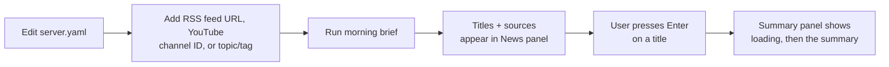
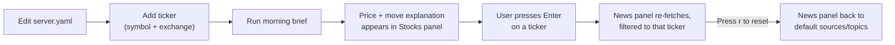
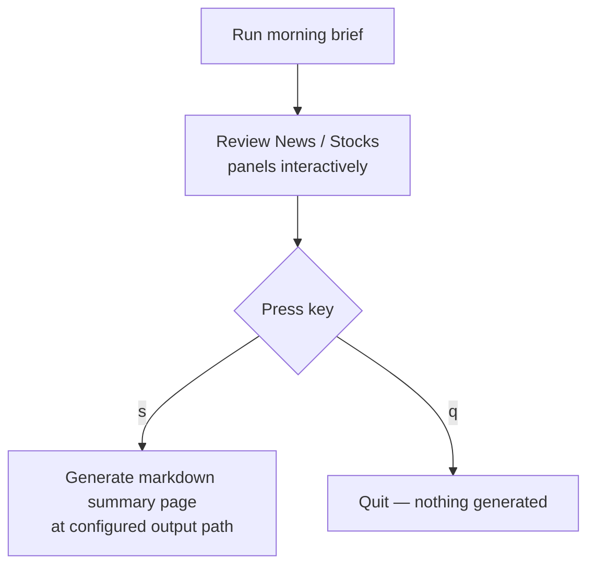
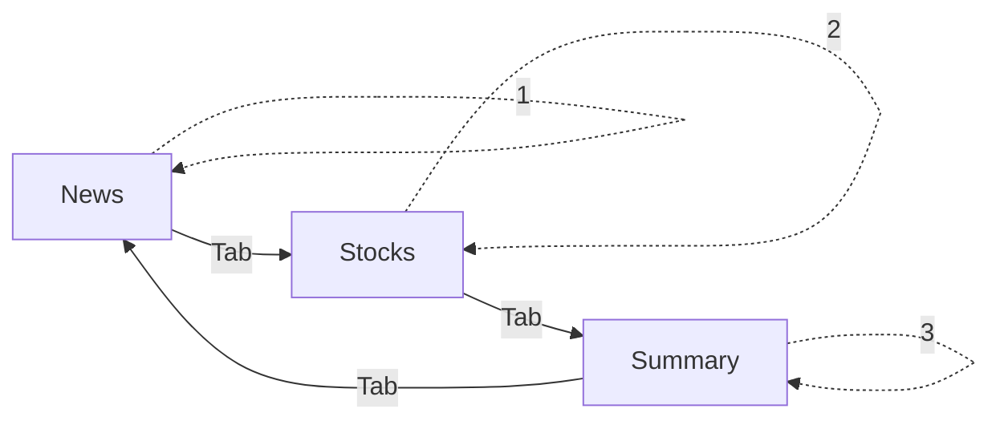
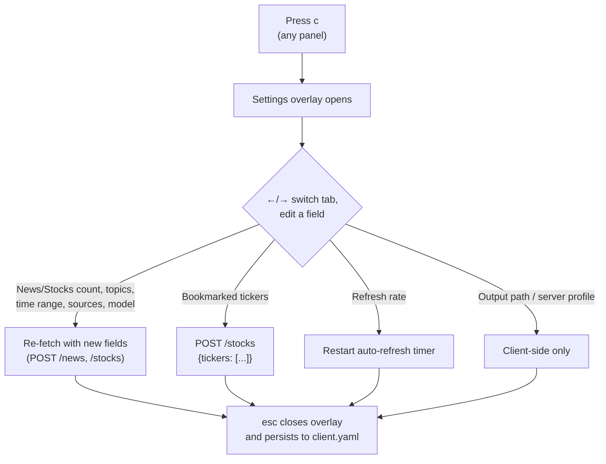
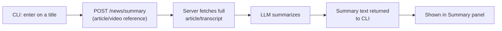
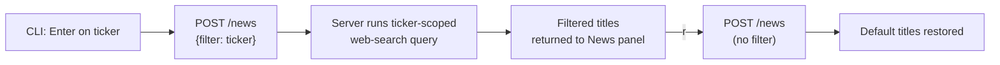
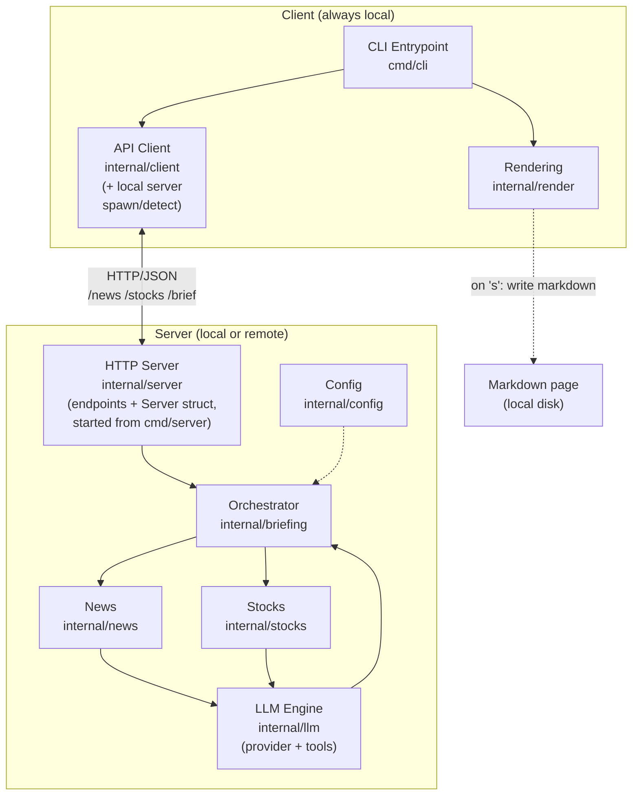
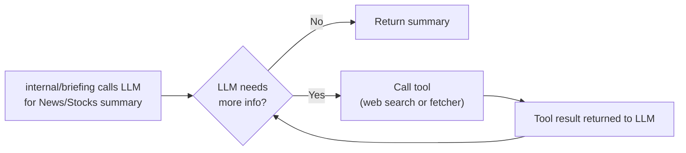
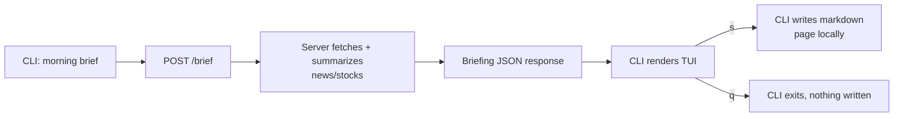

# Morning Brief — Product Specification

This document is the **canonical product specification** for `morning-brief`. When this document and any other document (Obsidian notes, `IMPLEMENTATION.md`, agent guides) disagree, this document wins for product behavior and `IMPLEMENTATION.md` wins for implementation mechanics.

Source history: adapted from the Obsidian note `Projects/Morning Brief CLI.md` (2026-08-04). That note is superseded by this file.

## Scope and Decisions

Decisions recorded here close the spec's former open questions. Anything not listed below remains an open question (see [Open Questions](#open-questions)).

| # | Decision | Rationale |
|---|----------|-----------|
| 1 | Supported platforms are **macOS and Linux only** (all phases unless re-decided). | Process-management lifecycle is Unix-first; Windows support is deferred, not implied. |
| 2 | The local (standalone) server **always binds to loopback** (`127.0.0.1`) on a **dynamic free port** chosen at spawn time. | Loopback-only is a security requirement, not a preference. Dynamic ports remove the fixed-port collision class entirely. |
| 3 | Remote mode (`--server <url>`) is limited to **trusted endpoints only** in the current phase: loopback, private networks, or endpoints the operator explicitly accepts. There is **no authentication** yet; public exposure of a server is unsupported and unsafe. | Authentication/tenancy is a separate design effort (see [Open Questions](#open-questions)). |
| 4 | `morning brief`'s server discovery uses a runtime state file that records PID, bound address, start time, and a **random instance token generated by the server itself**. The CLI reuses a process **only after identity verification** (PID alive *and* the server's authenticated `/healthz` accepts the matching token **and echoes it back**). Stopping the managed server is an authenticated `POST /shutdown` to the verified identity, followed by confirming the recorded process is dead — the CLI **never signals a PID it read from the state file**. The token defends against *accidental* conflicts (stale state, recycled PIDs, unrelated benign services on the recorded port); it is not a security boundary against malicious processes running as the same OS user. | PID-only ownership can target a recycled PID belonging to an unrelated process. |
| 5 | On save (`s`), a checked news article that was **never opened for a Summary is saved title-only**. No LLM work happens at save time. | Keeps the save step free of unexpected latency/cost and keeps the lazy-summary model coherent. |
| 6 | Project path: this repository (`github.com/toucham/morning-brief`, local checkout `projects/morning-brief`). | Previously open. |
| 7 | Runtime state (server state file, server log) lives in a **durable per-user state directory**, never in a disposable cache directory. | Cache directories may be cleared by the OS; the state file is the only management record for the persistent local server. |

## Context

A Go CLI to run every morning that summarizes news and explains stock moves — replacing a manual morning routine with one command. The system is split into a thin CLI client (rendering only) and a server (fetching, LLM, tool-calling, briefing assembly). By default the CLI runs **standalone**, transparently managing a local server for you — no separate deployment needed — or it can point at a **remote** server via `--server` for shared/always-on trusted setups.

## Features

| # | Feature | Summary |
|---|---------|---------|
| 1 | **News digest** | Summarizes news from configured sources (Yahoo News, YouTube channels, etc.) via LLM. |
| 2 | **Stock briefing** | Reports on tracked tickers (SET, VOO, etc.) and explains *why* each moved, using related news. |
| 3 | **Briefing output** | Combines the above into one briefing shown in an interactive terminal view; written to a markdown summary page only after the user reviews and confirms. |

### 1. News digest

- **Adding a source**: open the **server's** `server.yaml`, add an RSS feed URL or YouTube channel ID under `news:`, save, restart the server. The next `morning brief` run picks it up automatically — no code changes needed on the CLI side.
- **Adding topics/tags**: add free-text topics under `news.topics` (e.g. `"AI regulation"`, `"Thai economy"`) in `server.yaml`. In addition to the configured RSS/YouTube sources, the server queries for these topics/tags directly — via the web search tool (see [Agentic Tool Use](#agentic-tool-use) under Implementation) — so the digest isn't limited to what's already in a feed.
- **What you see**: the News panel lists just **titles**, each tagged with its source (feed name, YouTube channel, or `[Topic: X]` for a web-search result) — no inline summary yet. The list defaults to configured sources/topics, but can also be driven by a ticker filter from the Stocks panel (see [Stock briefing](#2-stock-briefing)) — `r` resets it back to this default.
- **Selecting an article**: use ↑/↓ to move between titles, press **Enter** to select one. A new **Summary** panel opens (the layout reflows to fit it) showing a loading state, then an on-demand LLM-generated summary of that specific article/video. Press `esc` to close the Summary panel and return to the list.
- **Choosing what's included in the output**: press **`space`** on a highlighted title to toggle its **inclusion checkbox** — only checked titles are written into the markdown page when `s` is pressed. This is independent of opening a title with Enter for its Summary.
- **Checkbox defaults and retention** (normative):
  - A title first seen in a session starts **checked**.
  - Check state is keyed by a stable **item identity** (the item's canonical URL; for YouTube, channel ID + video ID) and **persists across re-fetches, ticker filters, resets, and Settings changes** for the lifetime of the session.
  - Ticker filtering (`Enter` on a ticker) and reset (`r`) change which list is shown, not the check map. The saved output includes items present in the **currently shown list** that are checked.
  - An item that disappears from the list keeps its state in the session map (it re-checks if it reappears); it is not written to output while absent.
- **More display/source controls**: news count, topics/tags, time range, per-source enable/disable, and summary verbosity are all editable live via [Settings](#settings) (`c`), in addition to the static defaults in `server.yaml`.



See [CLI Usage → Sample run](#sample-run) for the full interactive flow, including what the News panel and Summary panel look like.

### 2. Stock briefing

- **Tracking a ticker**: add a `symbol` + `exchange` entry under `stocks.tickers` in the **server's** `server.yaml`. The next `morning brief` run fetches its price and, if it moved notably, explains why using related news.
- **What you see**: price, % change, direction arrow, and a one-line explanation per ticker in the Stocks panel.
- **Selecting a ticker**: use ↑/↓ to move between tickers, press **Enter** to select one — the News panel re-fetches and shows only news related to that ticker/company (its title bar changes to e.g. `News — filtered: VOO`). Press **`r`** to reset the News panel back to its default unfiltered view (configured sources + topics).
- **Auto-refresh**: the Stocks panel re-fetches automatically on a configured interval (default from `server.yaml`, overridable in [Settings](#settings) → General) while the session is open — no manual action needed to keep prices current.
- **More display/tracking controls**: stocks count, bookmarked tickers, and the refresh interval are all editable live via [Settings](#settings) (`c`), in addition to the static `stocks.tickers` default in `server.yaml`.
- **Bookmarked ticker list semantics** (normative): the request's `tickers` field is a **replacement list** — it overrides the server default entirely for that call. There is no additive/merge mode.



See [CLI Usage → Sample run](#sample-run) for the full interactive flow, including the ticker-filtered News panel and the reset back to its default.

### 3. Briefing output

- **Flow**: run `morning brief` → review both panels interactively → press `s` to generate a markdown summary page of the whole briefing, or `q` to quit without generating anything.
- **What you see**: nothing is written to disk until you explicitly confirm — the CLI is a review step, not an auto-writer. The generated page is a plain markdown file.
- **Save inclusion matrix** (normative): for each item in the currently shown News list:

  | Checked (`space`) | Opened (Enter, summary returned) | Written to page |
  |---|---|---|
  | yes | yes | Title + summary (as rendered) |
  | yes | no | **Title only** (no LLM work at save time) |
  | no | yes | Not written |
  | no | no | Not written |

  Stocks rows are always written when present in the panel (they have no inclusion checkbox).



See [CLI Usage → Sample run](#sample-run) for the full interactive flow, including the save confirmation.

### Panel Navigation

A cross-cutting scheme covering all panels (News, Stocks, and Summary once opened) — documented once here rather than repeated per feature:

- **Cycle focus**: `Tab` / `Shift+Tab` — moves focus to the next/previous visible panel (News → Stocks → Summary if open → back to News).
- **Jump directly**: `1` `2` `3` — jump straight to News / Stocks / Summary (Summary only reachable once opened).
- **Focused panel** is visually distinguished (highlighted border). ↑/↓ scroll/navigate within whichever panel currently has focus; `Enter`/`r`/`esc` act on the focused panel per that panel's own behavior (select article, select ticker, reset news, close summary).



### Settings

Press **`c`** from any panel to open a full-screen Settings overlay (this suspends the briefing view rather than reflowing panels, unlike the Summary panel). Settings are organized into **3 tabs**, switched with `←`/`→`:

- **General**: Output path, Model (LLM provider/model override), Server profile (switch/add named `server.url` entries), Refresh rate (s).
- **News**: News count, Topics/tags (add/remove), Time range, Sources (per-source enable/disable), Summary verbosity.
- **Stocks**: Stocks count, Bookmarked tickers (add/remove).

`↑`/`↓` moves between fields, `enter` edits the focused field, `space` toggles a checkbox (e.g. a source), `esc` closes the overlay and applies.

**Apply/persistence semantics** (normative):
- Edits are **validated inline**: an invalid value (bad URL, bad number, malformed ticker `SYMBOL@exchange`) is rejected in the field and does not apply.
- `esc` **applies and persists** the edited fields to the client config in one atomic write. If no field changed, nothing is written.
- There is no cancel/discard state in the current phase: once a field is edited, `esc` commits it. (A draft/cancel mode may be added later without breaking this contract.)
- Applying is **immediate** — no restart needed:
  - News/Stocks count, topics, time range, sources, or model changes trigger a live re-fetch of the affected panel(s) with the new values sent as request fields (see [Client/Server API](#clientserver-api) under Implementation).
  - Summary-verbosity changes take effect on the **next** `POST /news/summary` call (an already-rendered summary is not regenerated).
  - Bookmarked-ticker changes trigger a `POST /stocks` re-fetch with the updated (replacement) ticker list.
  - Refresh-rate changes restart the Stocks panel's auto-refresh timer.
  - Output-path and server-profile changes are purely client-side and take effect on the next save / next request respectively.
- **Server profiles**: the client config holds an optional `server.profiles` list (`[{name, url}]`) plus the active `server.url`. Switching a profile in Settings copies that profile's URL into `server.url`. `--server <url>` sets `server.url` directly (and upserts a profile named `default` with that URL for discoverability).

Note: **which news items appear in the saved output** is *not* set here — it's the per-title `space`-toggle inclusion checkbox directly in the News panel (see [News digest](#1-news-digest)).



See [CLI Usage → Sample run](#sample-run) for the full interactive flow, including the Settings overlay mock.

### Standalone vs Remote

By default, `morning brief` runs **standalone** — the CLI transparently spawns-or-reuses a local server process, so nothing needs to be deployed separately. It can also point at a **remote** server for shared/always-on **trusted** setups (see decision 3 in [Scope and Decisions](#scope-and-decisions)).

- **`morning brief`** (no flag) — uses whatever `client.yaml`'s `server.url` currently says: absent/unset → standalone; set → remote.
- **`morning brief --server <url>`** — use a remote server and **persist** that URL into `client.yaml`, so it becomes the default for future runs too (no need to repeat the flag). The URL must be syntactically valid `http://` or `https://`; invalid URLs are rejected before persistence.
- **`morning brief --standalone`** — clear any saved `server.url` and revert to standalone.
- **`morning server stop`** — explicitly stop a running standalone local server (it is no longer auto-killed on exit; it stays running across invocations for faster subsequent starts).

**Local server discovery** (normative): the CLI checks a runtime state file (e.g. `~/.local/state/morning-cli/server.lock` on Linux; `~/Library/Application Support/morning-cli/server.lock` on macOS) recording the spawned process's PID, bound loopback address, start time, and instance token:

- If the state file is absent → spawn (below).
- If present: the CLI considers the server **valid** only when (a) the recorded PID is alive *and* (b) `GET /healthz` on the recorded address — presented with the state file's token as a Bearer credential — returns HTTP 200 **with the same token echoed back**. The server does the token comparison and the CLI checks the echo, so verification holds even if an unrelated benign service happens to serve that port. Valid → reuse.
- If invalid (dead PID, unreachable, or token mismatch) → the state file is **stale or foreign**: the CLI removes the stale state file only when it can prove the recorded process is dead, otherwise it refuses and reports the conflict; it **never signals a PID read from the state file** — `morning server stop` performs an authenticated `POST /shutdown` against the verified instance, then confirms the recorded process is dead before removing the state file. Every read/validate/spawn/stop operation holds an exclusive **lifecycle lock** (acquired *before* the state file is first read), so two simultaneous CLIs cannot both spawn or stop.
- Spawn: the CLI holds the lifecycle lock, spawns `cmd/server` with `--address 127.0.0.1:0` and `--state-file <path>` (the server generates its own random token — the token never appears in command-line arguments), waits (bounded, ~3s) for the server to atomically publish a state file recording the child's own PID and for authenticated `/healthz` to verify its token, then releases the lock. On any failure the CLI terminates the child it spawned (the only case where a process is ever signaled — always this invocation's own child, and only while its `Wait` is still pending), cleans up any partial state, and reports the error.

```mermaid
flowchart TD
    A["morning brief"] --> B{server.url set<br>in client.yaml?}
    B -->|Yes, and no --standalone| G[Use remote server.url<br>(trusted endpoint only)]
    B -->|No, or --standalone| L[Acquire lifecycle lock]
    L --> C{State file valid?<br>alive PID + authed /healthz<br>echoing the token}
    C -->|Yes| D[Use it, release lock]
    C -->|No / stale| E[Remove stale state if provably dead,<br>spawn cmd/server on 127.0.0.1:0<br>(server generates its own token)]
    E --> F[Wait for state file +<br>/healthz identity check]
    F --> D
    D --> H[Proceed as normal<br>HTTP client flow]
    G --> H
```

## CLI Usage

`morning brief` is the primary command: it opens a live terminal UI showing both News and Stocks panels together and lets the user review the briefing before deciding whether to save it (see [Interactive Rendering](#interactive-rendering) under Implementation for how). The CLI itself does no fetching or LLM work — `morning brief` calls `POST /brief` on the server, which internally fetches and summarizes both News and Stocks (see [Client/Server API](#clientserver-api) under Implementation). The server's `POST /news`, `POST /stocks`, and `POST /news/summary` endpoints still exist and are still used — automatically, by the running TUI — for the ticker-filter re-fetch and the on-demand article summary; they're just not exposed as separate CLI subcommands. `morning server stop` is a server-management subcommand, not a briefing command.

**Flags** (see [Standalone vs Remote](#standalone-vs-remote) under Features):

| Command | Behavior |
|---|---|
| `morning brief` | Uses whatever mode is currently saved — standalone by default, or remote if a `server.url` was previously persisted. |
| `morning brief --server <url>` | Use a remote server; persists the URL so future runs default to it too. |
| `morning brief --standalone` | Clear any saved `server.url`; use/spawn a local server instead. |
| `morning server stop` | Stop a running standalone local server. |

## Sample run

The following is one continuous session, start to finish, covering every interactive flow the CLI supports.

**0. First run only** — no local server is running yet, so the CLI spawns one before proceeding (subsequent runs skip straight to step 1, since the state file shows a verified instance is already up):

```
$ morning brief

⠋ Starting local server... (first run)
```

**1. `$ morning brief`** — spinners while news and stocks fetch/summarize:

```
$ morning brief

⠋ Fetching news...      (3 sources)
⠋ Fetching stocks...    (2 tickers)
```

**2. Interactive view appears** — News (66% width) and Stocks (33% width) side by side, each scrolling independently; News lists titles + sources with an inclusion checkbox:

```
┌─ News ──────────────────────────────────────────────┐┌─ Stocks ───────────┐
│ ▸[x] Fed holds rates steady amid cooling...         ││ VOO  $512.34 +0.8% │
│      Yahoo News                                     ││   tracking a...    │
│  [x] Thai baht strengthens as tourism...            ││ SET 1,402.10 -1.2% │
│      Bangkok Post RSS                               ││   dragged down...  │
│  [ ] [AI Roundup] New model releases...             ││ ↓ more (2/5)       │
│      YouTube: Some Channel                          │└────────────────────┘
│ ↓ more (3/7)                                         │
└─────────────────────────────────────────────────────┘
 ↑/↓ scroll · tab switch panel · space include · enter select article · c settings · s save · q quit
```

(The mixed checked/unchecked view above is *after* the user has toggled one title; fresh sessions start with all titles checked.)

**3. Press `enter` on the highlighted News title** — the News (66%)/Stocks (33%) row is unaffected; a full-width Summary panel pops up below with a loading state:

```
┌─ News ──────────────────────────────────────────────┐┌─ Stocks ───────────┐
│ ▸[x] Fed holds rates steady amid cooling...         ││ VOO  $512.34 +0.8% │
│      Yahoo News                                     ││ SET 1,402.10 -1.2% │
│ ↓ more (3/7)                                         ││ ↓ more (2/5)       │
└─────────────────────────────────────────────────────┘└────────────────────┘
┌─ Summary ───────────────────────────────────────────────────────────────────────┐
│ ⠋ Summarizing...                                                              │
└────────────────────────────────────────────────────────────────────────────────┘
```

**4. The summary returns** — title, date, short summary, and source link at the bottom:

```
┌─ News ──────────────────────────────────────────────┐┌─ Stocks ───────────┐
│ ▸[x] Fed holds rates steady amid cooling...         ││ VOO  $512.34 +0.8% │
│      Yahoo News                                     ││ SET 1,402.10 -1.2% │
│ ↓ more (3/7)                                         ││ ↓ more (2/5)       │
└─────────────────────────────────────────────────────┘└────────────────────┘
┌─ Summary ───────────────────────────────────────────────────────────────────────┐
│ Fed holds rates steady amid cooling inflation data                            │
│ Aug 6, 2026                                                                    │
│                                                                                 │
│ The Fed held its benchmark rate steady, citing cooling inflation and a        │
│ resilient labor market. Most officials signaled no rate cuts before Q4.       │
│                                                                                 │
│ Source: https://news.yahoo.com/fed-holds-rates-steady-...                     │
└──────────────────────────────────────────────────────────────────────────────────┘
 space include · enter select · esc back · ↑/↓ scroll panel · s save · q quit
```

**5. Press `esc`** — the Summary panel closes; back to the plain 2-panel view (same as step 2).

**6. Press `tab`/`2`, then `enter` on VOO** — focus moves to Stocks (highlighted border); selecting VOO re-fetches the News panel, filtered to that ticker:

```
┌─ News — filtered: VOO ──────────────────────────────┐┌─ Stocks (focused) ─┐
│ ▸[x] VOO climbs on broad tech rally as Fed holds... ││ ▸ VOO $512.34 +0.8%│
│      Yahoo News                                     ││   SET 1,402.10-1.2%│
│  [x] S&P 500 fund inflows accelerate into VOO       ││ ↓ more (2/5)       │
│      Bangkok Post RSS                               │└────────────────────┘
│ ↓ more (2/6)                                         │
└─────────────────────────────────────────────────────┘
 r reset news · space include · enter select · tab/1-3 switch panel · s save · q quit
```

**7. Press `r`** — the News panel resets back to its default, unfiltered list (same as step 2).

**8. Press `c`** — the tabbed Settings overlay opens (News tab shown); the user switches to the Stocks tab and adds a ticker:

```
┌─ Settings ── General │ News │ Stocks ────────────────────────────────┐
│                                                                      │
│  Stocks count           [ 5                     ]                   │
│  Bookmarked tickers     [ VOO, SET  ]  (+ add · - remove)           │
│                                                                      │
└──────────────────────────────────────────────────────────────────────┘
 ←/→ switch tab · ↑/↓ move · enter edit · esc close & apply
```

Pressing `esc` closes the overlay, applies, and persists — the Stocks panel now shows the newly added ticker "AAPL":

```
┌─ News ──────────────────────────────────────────────┐┌─ Stocks ───────────┐
│ ▸[x] Fed holds rates steady amid cooling...         ││ VOO  $512.34 +0.8% │
│      Yahoo News                                     ││ SET 1,402.10 -1.2% │
│ ↓ more (3/7)                                         ││ AAPL $228.10 +1.4% │
│                                                       ││ ↓ more (3/5)       │
└─────────────────────────────────────────────────────┘└────────────────────┘
 ↑/↓ scroll · tab switch panel · space include · enter select article · c settings · s save · q quit
```

**9. Press `s`** — the reviewed briefing (only `space`-checked News titles in the current list, plus Stocks) is written to a markdown summary page at the configured output path (see the [Page template](#briefing-output) under Implementation):

```
 [s] Generated ~/morning-briefings/2026-08-06.md
```

Pressing `q` instead — at any point in the session — exits without writing anything:

```
 [q] Quit — nothing generated
```

## Implementation

### News digest

- **Sources**: RSS feeds (e.g. Yahoo News), YouTube channels (Data API + transcripts), web scraping as fallback, optional News API service.
- **Topics/tags**: free-text topics configured under `news.topics` are queried directly via the web search tool (see [Agentic Tool Use](#agentic-tool-use)) rather than a `Fetcher` — this lets the digest cover subjects with no dedicated feed.
- **Flow**: each source's `Fetcher` pulls recent articles/videos, and each configured topic triggers a web-search-tool query — this initial pass returns **titles + source + link only**, no LLM summarization yet. A full per-article/video summary is generated **lazily**: only when the CLI calls `POST /news/summary` for a specific title the user selected (see [Client/Server API](#clientserver-api)), the server fetches that item's full content and asks the LLM to summarize it.
- **CLI-configurable fields**: `POST /news` accepts optional `limit` (display count), `filter` (`{ticker}`), `topics` (replacement list), `timeRange`, `sources` (per-source enable/disable list), and `model`, all sent by the CLI and editable live via [Settings](#settings). Omitting any of them falls back to `server.yaml` defaults. (Summary `verbosity` belongs to `POST /news/summary`, not here.)
- **Output inclusion**: the markdown page's `## News` section follows the [save inclusion matrix](#3-briefing-output) — checked titles in the current list, title-only unless a summary was generated during the session.
- **Package**: `internal/news` (`rss`, `youtube`, `scrape` sub-fetchers) + `internal/llm` (topic queries via tool-calling, on-demand per-article summarization).



The `POST /news/summary` response includes `title`, `publishedAt` (date), `summary` (the short LLM-generated text), and `sourceURL` — the CLI renders these as the Summary panel's title/date/summary/source-link layout (see [Sample run](#sample-run)).

### Stock briefing

- **Price data**: free API (unofficial Yahoo Finance primary, Stooq fallback — provider comparison and rationale in [IMPLEMENTATION.md → Stock Tracking](IMPLEMENTATION.md#stock-tracking-phase-4-internalstocks)) — no key required, must cover US (VOO) and Thai (SET) tickers. Acceptance criteria for provider choice: (a) no API key, (b) both exchanges covered, (c) documented rate limits and how the server stays under them, (d) explicit behavior for unknown/invalid symbols (error surfaced in the panel, never a crash), (e) price-staleness reporting (timestamp per quote).
- **Move explanation**: on a notable price change, search news (reusing `internal/news`) for the ticker/company, then ask the LLM to explain the move. Matching strategy is open (see [Open Questions](#open-questions)).
- **News filtering**: selecting a ticker in the CLI calls `POST /news` with the optional ticker/company filter in the request body; the server runs a ticker-scoped web-search-tool query (reusing the same mechanism as topic queries) instead of the default configured sources/topics, returning a filtered titles list. Resetting (`r`) re-calls `POST /news` with no filter.
- **CLI-configurable fields**: `POST /stocks` accepts optional `limit` (display count), `tickers` (bookmarked list — a **replacement**, not a merge, of the `server.yaml` default), `verbosity`, and `model`, all sent by the CLI and editable live via [Settings](#settings).
- **Auto-refresh**: a periodic Bubble Tea tick message calls `POST /stocks` on the configured `refreshIntervalSeconds` while the session is open, keeping prices current without manual input.
- **Package**: `internal/stocks`.



### Briefing output

- **Assembly**: `internal/briefing` (server-side) runs news → stocks and combines results into one `Briefing`, served to the CLI over `POST /brief`.
- **Rendering**: the CLI's `internal/render` prints the received `Briefing` to the interactive terminal UI first; the markdown summary page is **not** generated automatically. The user reviews the briefing, then presses `s` to write it out locally (`q` quits without generating anything) — the page is only produced after that explicit confirmation.
- **Package**: `internal/render` (CLI-side).
- **Output location**: plain markdown file — path is configurable via `output.path` in the client config (e.g. `~/morning-briefings/YYYY-MM-DD.md`), defaulting to a sensible location if unset.
- **Page template** — the generated page mirrors terminal output (no condensing), structured as:
  ```markdown
  ---
  date: 2026-08-06
  tags: [morning-briefing]
  ---
  # Morning Briefing — 2026-08-06

  ## News
  - Fed holds rates steady amid cooling inflation data (Yahoo News)
    - **Summary**: The Fed held its benchmark rate steady, citing cooling
      inflation and a resilient labor market. *(only for checked titles that
      were opened and summarized during the session — see [save inclusion
      matrix](#3-briefing-output))*
  - Thai baht strengthens as tourism rebounds (Bangkok Post RSS)

  ## Stocks
  - **VOO**: $512.34 (+0.8%) — tracking a broad rally in tech following stable Fed guidance.
  - **SET**: 1,402.10 (-1.2%) — dragged down by profit-taking after last week's rally.
  ```

### Architecture

The system is two binaries: a thin **CLI client** (always runs on the user's machine) and a **server** (deployable either on that same machine or remotely) that owns all fetching, LLM, and orchestration logic. They talk over HTTP/JSON REST (see [Client/Server API](#clientserver-api) below).



- **Deployment**: the server binary is identical whether run locally or remotely; only the CLI's configured `server.url` changes between setups. In **standalone** mode, `internal/client` transparently manages the server's lifecycle — spawning a `cmd/server` child process or reusing one already running, tracked via the runtime state file described in [Standalone vs Remote](#standalone-vs-remote). In **remote** mode, the server is a separately-deployed process the CLI never spawns or manages — it only sends HTTP requests to the configured `server.url`.
- **Dependency direction (normative)**: `internal/llm` defines the tool interface and tool registry but **never imports** `internal/news` or `internal/stocks`. `internal/news` and `internal/stocks` import `internal/llm` for summarization. `internal/briefing` (or `cmd/server` wiring) composes news/stocks fetchers as LLM tools at startup. This keeps the import graph acyclic: `briefing → {news, stocks, llm}`, `news/stocks → llm`, `llm → (nothing internal)`.

### LLM Provider Abstraction

Server-side (`internal/llm`). Achieved via **LangChainGo** (`github.com/tmc/langchaingo`) — the most mature Go LLM library, providing a unified `llms.Model` interface implemented by Claude, OpenAI, Ollama, and others, plus built-in tool/function-calling support. Swapping providers is a constructor/config change, not a rewrite of calling code.

Considered and rejected for now: **Eino** (ByteDance) — graph-based multi-agent orchestration, more powerful but heavier (~37 dependencies) than a single tool-calling loop needs; **Genkit for Go** (Google) — similar abstraction, well-documented, but pulls in more dependencies (~129) and Google-ecosystem conventions. Both remain candidates if the agent's needs outgrow LangChainGo.

**Per-request model override**: the CLI can send an optional `model` field on `/news`, `/stocks`, `/news/summary`, and `/brief` requests (set via [Settings](#settings) → General → Model) to use a different provider/model than the server's `llm.provider`/`llm.model` default for that call — useful for trying a cheaper/faster model without editing `server.yaml`.

Illustrative shape:
```go
type Provider interface {
    Generate(ctx context.Context, prompt string, tools ...llms.Tool) (string, error)
}
// internal/llm/claude.go, internal/llm/openai.go, internal/llm/ollama.go
// each wraps a langchaingo llms.Model, selected in internal/config by `llm.provider`
```

### Agentic Tool Use

Server-side. News and Stocks summarization isn't limited to pre-fetched RSS/price data — the LLM can call a tool mid-summarization to look up more context.

- **Web search tool** — wraps a search API (e.g. Brave Search) as a callable tool; used when the LLM needs info beyond what was fetched (e.g. "why did VOO move today").
- **Fetcher tools** — the existing `internal/news` and `internal/stocks` fetchers are also exposed as callable tools, so the LLM can re-query a specific configured source on demand instead of only receiving pre-fetched data as static context. The tool *interface and registry* live in `internal/llm`; the actual registrations are composed by `internal/briefing` (or `cmd/server`) at startup so `internal/llm` never imports the domain packages (see [dependency direction](#architecture)).



### Client/Server API

The HTTP endpoints and the `Server` struct that wires them to `internal/briefing` live in **`internal/server`**; `cmd/server` is the entrypoint that constructs a `server.Server` and starts it listening. The CLI never fetches or calls the LLM directly — `morning brief` calls `POST /brief` on load, and the running TUI calls the other endpoints automatically as the user interacts (ticker filter, article summary). These endpoints behave identically whether the server was auto-spawned locally (standalone mode) or deployed remotely — only how the CLI discovers the base URL differs (see [Standalone vs Remote](#standalone-vs-remote) under Features):

| Endpoint | Behavior |
|---|---|
| `POST /news` | Runs the News digest flow, returns a list of titles + sources (no per-article summaries). Accepts optional fields: `filter: {ticker}` (scope to a stock ticker/company, used by the Stocks-panel re-fetch), `limit`, `topics` (replacement list), `timeRange`, `sources`, `model`. Omitting any field falls back to the `server.yaml` default. |
| `POST /news/summary` | Given a specific article/video reference from the News list, fetches its full content and returns an LLM-generated summary. Accepts optional `verbosity` and `model`. Called on-demand when the user selects a title. |
| `POST /stocks` | Runs the Stock briefing flow, returns Stocks section JSON. Accepts optional fields: `limit`, `tickers` (replacement list), `verbosity`, `model`. |
| `POST /brief` | Runs both and returns the combined `Briefing` JSON. Accepts optional nested overrides mirroring the above: `news: {limit, filter, topics, timeRange, sources, model}` and `stocks: {limit, tickers, verbosity, model}`, plus a top-level `model`. This is how the CLI's saved/Settings-edited preferences affect the initial briefing. Precedence: request fields > client config > `server.yaml` defaults. |
| `GET /healthz` | Operational endpoint (not a briefing endpoint): requires `Authorization: Bearer <token>`; returns HTTP 200 with the server's instance token and protocol version only when the token matches. Used by the CLI for spawn readiness and identity verification. Never performs fetching or LLM work. |
| `POST /shutdown` | Operational endpoint (not a briefing endpoint): requires `Authorization: Bearer <token>`; initiates a bounded graceful shutdown of the server. Used by `morning server stop` after identity verification — this is how a persistent local server is stopped, since the CLI never signals a PID read from the state file. Never performs fetching or LLM work. |

Field precedence for every endpoint: **explicit request field > client config (sent by CLI) > `server.yaml` default**. A field omitted at every level falls back down the chain.



### Interactive Rendering

`internal/render` builds an interactive terminal UI using the **Charm stack**, instead of a one-shot print:

| Library | Role |
|---|---|
| **Bubble Tea** | App loop — model/update/view, handles keypresses (scroll, select, quit), async messages (fetch progress). |
| **Bubbles** | Pre-built widgets: `spinner` (loading state per section), `viewport` (independent scroll per panel). |
| **Lip Gloss** | Styling — panel borders, colors, layout (side-by-side/stacked panels). |
| **Glamour** | Renders each panel's Markdown content (headlines, stock lines) with proper formatting inside the styled panes. |

News and Stocks panels are visible side by side at a fixed **66%/33%** width split (News gets the larger share, since it carries more content) — set via Lip Gloss layout, not user-resizable. Each scrolls independently when its content overflows, with its own `↓ more` hint. When a News title is selected, the News/Stocks row is unaffected; instead a new **full-width** Summary panel pops up **below** the row (also `viewport`-rendered, like the others), populated asynchronously via a Bubble Tea async message once `POST /news/summary` returns — shown as a loading state (`spinner`) in the meantime, closed with `esc`. Its content is laid out as title, date, the short LLM-generated summary, and the source link at the bottom. Moving focus between panels uses the `Tab`/`Shift+Tab` cycle and `1`–`3` direct-jump keys documented in [Panel Navigation](#panel-navigation) under Features; the focused panel is drawn with a highlighted border. The briefing is for review only until the user explicitly confirms — pressing `s` generates the markdown summary page, `q` quits without generating anything. See the interactive mockup under [Sample run](#sample-run).

The **Settings overlay** (opened with `c`, see [Settings](#settings) under Features) is a full-screen Bubble Tea view swapped in over the briefing view — it suspends rather than reflows the News/Stocks/Summary panels. Its tabs switch via `←`/`→`. The Stocks panel's **auto-refresh** is a periodic Bubble Tea tick message dispatching `POST /stocks` on the configured interval.

- **Config & code location**: two config files. The **client** config (e.g. `~/.config/morning-cli/client.yaml`) holds `server.url` (or a named `server.profiles` list + active profile), `output.path`, and the Settings-overlay-editable fields: `news.count`, `news.topics`, `news.timeRange`, `news.sources` (enabled map), `news.verbosity`, `stocks.count`, `stocks.bookmarks`, `stocks.refreshIntervalSeconds`, `llm.model`. `server.url` is **absent by default** (standalone mode) and only gets set/persisted when the user runs `--server <url>`; `--standalone` clears it again. The CLI also maintains the runtime state file (durable state directory, not a cache directory) recording the auto-spawned local server's PID, bound address, start time, and instance token, used to detect whether to reuse or respawn it. The **server** config (e.g. `~/.config/morning-server/server.yaml`) holds the corresponding defaults (feeds, channels, tickers, LLM provider choice, tool settings); API keys stay in environment variables, not either file. Code lives in this Go project as two binaries in one module: `cmd/cli` (client entrypoint) and `cmd/server` (server entrypoint, starts `internal/server`).

## Roadmap

Ordered as vertical slices; each slice ends in a demonstrable product increment.

1. **Client/server split (scaffold)** — both binaries (`cmd/cli`, `cmd/server`) in one module; stub `POST /brief` + operational `GET /healthz` / `POST /shutdown`; safe standalone auto-spawn/detect (state file, instance token, lifecycle lock, authenticated shutdown, loopback dynamic port); `--server`/`--standalone` flags with persistence to `client.yaml`; `morning server stop`. Mechanics in [IMPLEMENTATION.md → Overview](IMPLEMENTATION.md#overview) through [CLI Command Logic](IMPLEMENTATION.md#cli-command-logic-in-cmdcli).
2. **News list** — config loaders (client + server); RSS `Fetcher`; `POST /news` titles + sources; CLI renders the list with inclusion checkboxes (plain terminal rendering is acceptable at this stage). Mechanics in [IMPLEMENTATION.md → News Digest Engine](IMPLEMENTATION.md#news-digest-engine-phase-2-internalnews).
3. **Lazy summaries** — `internal/llm` provider abstraction; web-search tool; `POST /news/summary`; interactive TUI introduced (Bubble Tea list + full-width Summary panel). Mechanics in [IMPLEMENTATION.md → LLM Engine & Agentic Tool Use](IMPLEMENTATION.md#llm-engine--agentic-tool-use-phase-3-internalllm).
4. **Stocks** — price fetch with fallback provider (Yahoo Finance primary, Stooq fallback; mechanics in [IMPLEMENTATION.md → Stock Tracking](IMPLEMENTATION.md#stock-tracking-phase-4-internalstocks)); `POST /stocks`; Stocks panel; ticker-filtered News re-fetch and `r` reset.
5. **Unified output** — `internal/briefing` orchestration; `POST /brief` with nested overrides; 66/33 layout; reviewed save to markdown at the configured path per the save inclusion matrix. Mechanics in [IMPLEMENTATION.md → Unified Briefing & TUI Rendering](IMPLEMENTATION.md#unified-briefing--tui-rendering-phase-5-internalbriefing-internalrender).
6. **Settings** — tabbed Settings overlay (`c`); per-request override fields on `/news`/`/stocks`/`/news/summary`; Stocks auto-refresh timer; server-profile switching; apply-and-persist semantics. Mechanics in [IMPLEMENTATION.md → Settings Overlay & Live Sync](IMPLEMENTATION.md#settings-overlay--live-sync-phase-6-internalrendersettings).
7. **Polish** — error handling/retries, caching, scheduling docs (cron/launchd), server deployment docs (local vs remote). Mechanics in [IMPLEMENTATION.md → Production Polish & Operational Runbooks](IMPLEMENTATION.md#production-polish--operational-runbooks-phase-7).

## Open Questions

- Actual list of RSS feeds / YouTube channels / tickers to track.
- How to match stock moves to relevant news (by company name? sector? macro?).
- How the CLI will be scheduled to run each morning (cron, launchd, manual).
- Remote-server authentication (API key? mTLS?) and multi-user tenancy — **blocked by design until decided**: until then remote mode is trusted-endpoints-only (decision 3) and servers must not be exposed publicly.
- YouTube Data API key sourcing and quota management for transcripts (no-key mode vs. user-provided key in env var).
