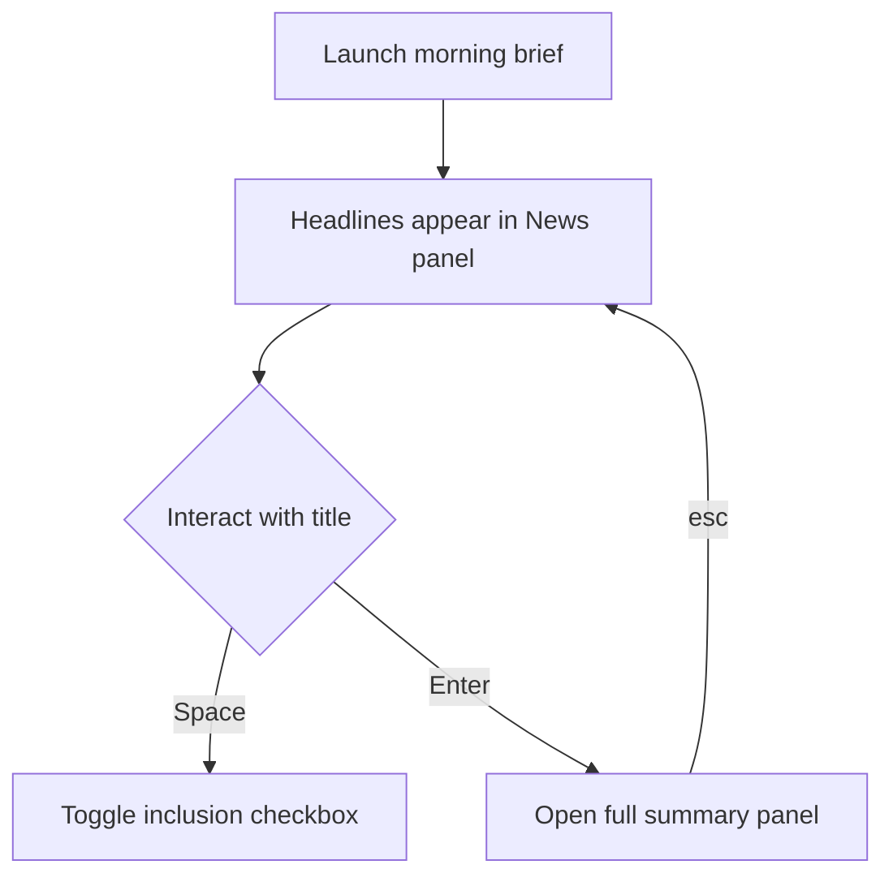
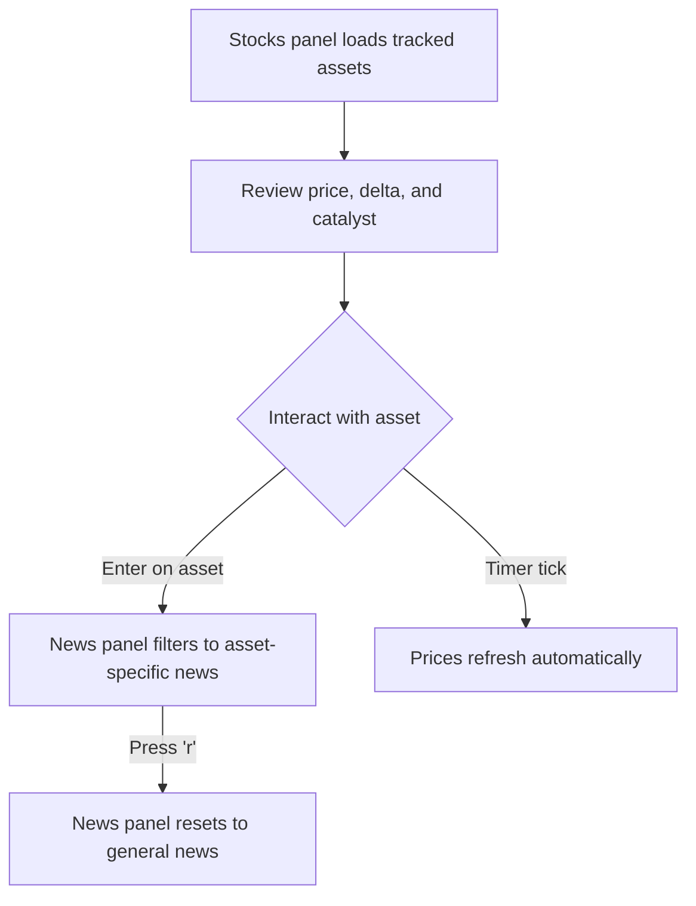
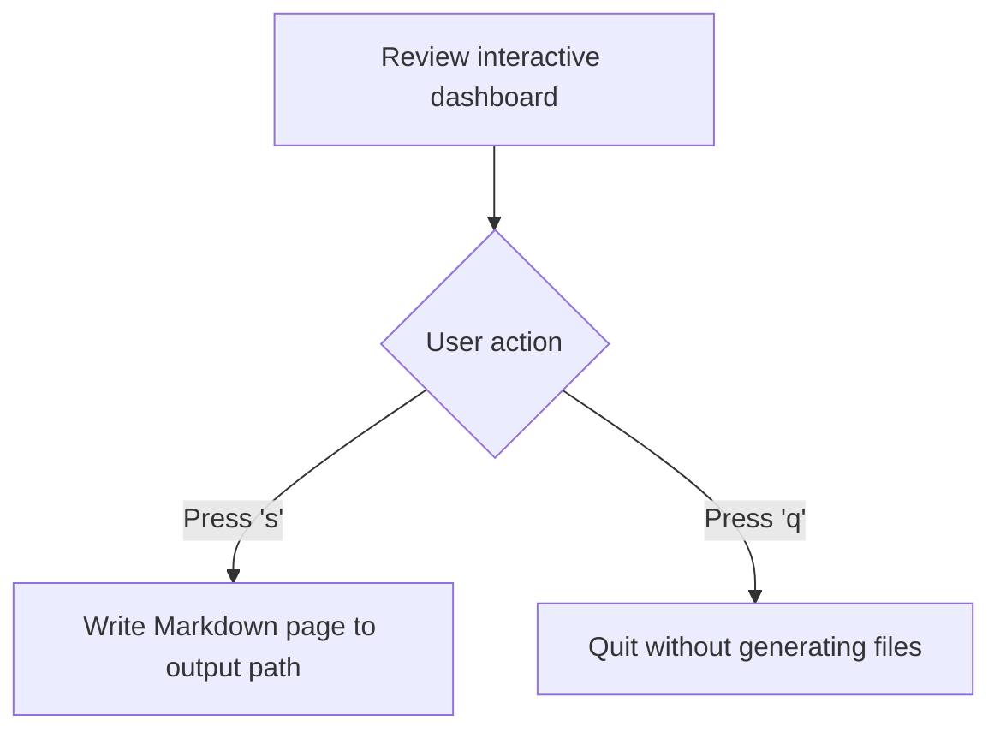
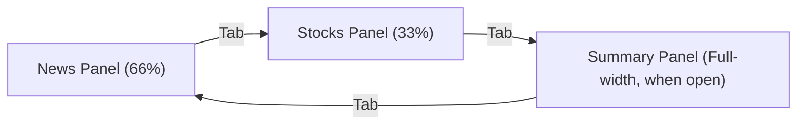
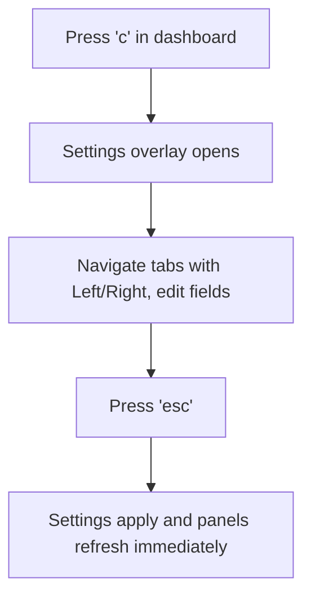

# Morning Brief — Product Specification

This document is the **canonical product specification** for `morning-brief`. It defines product capabilities, features, and the user interface / user experience (UI/UX). For system design, data flow, and package structure, see [docs/ARCHITECTURE.md](ARCHITECTURE.md).

---

## Context

A morning briefing tool you run every morning that summarizes news and explains financial market moves — replacing a manual morning routine with one focused command.

The product presents an interactive terminal interface for reviewing headlines and portfolio movements side-by-side, diving into on-demand article summaries, selecting items to include, and optionally exporting a formatted Markdown summary page for note-taking systems.

---

## Features

| # | Feature | Summary |
|---|---------|---------|
| 1 | **News digest** | Aggregates titles from configured sources (RSS feeds, YouTube channels, topic searches) with on-demand AI summaries. |
| 2 | **Stock briefing** | Tracks selected financial products (ETFs, stocks, indices), reporting daily changes and explaining why each asset moved. |
| 3 | **Briefing output** | Combines news and financial movements into an interactive terminal view; exports to Markdown only after user confirmation. |

---

### 1. News Digest

- **Sources & Topics**: Pulls recent stories from designated news sources (such as RSS feeds and YouTube channels) alongside custom interest topics (e.g. `"AI regulation"`, `"Thai economy"`).
- **Headlines View**: The News panel displays headlines tagged with their source name or topic badge (`[Topic: X]`). Items start without inline summaries to keep the initial display instant.
- **Selecting an Article for Summary**: Move highlight up or down with arrow keys and press **Enter** on any headline. A Summary panel opens below the main panels showing a brief loading indicator, followed by an on-demand AI summary of the specific story or video transcript, along with publication date and source URL. Pressing `esc` closes the summary.
- **Selective Output Inclusion**: Press **Space** on any highlighted headline to toggle its inclusion checkbox (`[x]` / `[ ]`). Only checked items are exported if the user decides to save the briefing.
- **Checkbox Defaults and Persistence**:
  - Newly discovered headlines start **checked** by default.
  - Inclusion status is retained across live re-fetches, ticker filters, and settings adjustments for the duration of the session.
  - An article that is filtered out retains its toggle state in memory; if it reappears, its previous checked state is restored.
- **Customizable Display**: Display count, topic keywords, time range, source toggles, and summary detail level are adjustable live through the Settings overlay (`c`).



---

### 2. Stock Briefing

- **Tracked Financial Products**: Monitors symbols and exchanges chosen by the user (such as `VOO`, `SET`, or individual company equities).
- **Movement & Catalyst Explanations**: For each tracked asset, the Stocks panel displays current price, percentage change, directional movement indicator, and a concise explanation highlighting the primary news or market catalyst behind notable moves.
- **Filtering News by Asset**: Press **Enter** on any highlighted asset in the Stocks panel to instantly filter the News panel to stories and developments relevant to that specific company or index (the panel header updates to e.g. `News — filtered: VOO`). Press **`r`** at any time to reset the News panel back to the general feed.
- **Automatic Background Refresh**: Prices in the Stocks panel update periodically on a configurable timer while the session remains open.
- **Customizable Portfolio**: Tracked assets, display count, and refresh frequency can be updated directly within the Settings overlay (`c`).



---

### 3. Briefing Output & Export

- **Interactive Review First**: Launching `morning brief` displays an interactive dashboard for review. Nothing is written to disk automatically.
- **Saving to Markdown**: Pressing **`s`** writes a structured Markdown document to the configured output path. Pressing **`q`** exits immediately without writing any files.
- **Save Inclusion Rules**:
  - **Checked + Opened & Summarized**: Exported with title and the rendered summary.
  - **Checked + Unopened**: Exported as title and source only (no unexpected AI generation latency at save time).
  - **Unchecked**: Omitted entirely from the exported document.
  - **Tracked Assets**: Active financial rows are always included in the export.

#### Output Page Format

The saved Markdown page is formatted for personal knowledge bases:

```markdown
---
date: 2026-08-06
tags: [morning-briefing]
---
# Morning Briefing — 2026-08-06

## News
- Fed holds rates steady amid cooling inflation data (Yahoo News)
  - **Summary**: The Fed held its benchmark rate steady, citing cooling
    inflation and a resilient labor market. Most officials signaled no rate cuts before Q4.
- Thai baht strengthens as tourism rebounds (Bangkok Post RSS)

## Stocks
- **VOO**: $512.34 (+0.8%) — tracking a broad rally in tech following stable Fed guidance.
- **SET**: 1,402.10 (-1.2%) — dragged down by profit-taking after last week's rally.
```



---

## User Interface & Navigation

### Layout & Sizing
- **Main View**: Side-by-side two-column split with **News (66% width)** on the left and **Stocks (33% width)** on the right. Both panels scroll independently when item counts exceed terminal height.
- **Summary View**: Selecting an article opens a full-width Summary panel directly beneath the main row without disturbing column alignment.
- **Visual Focus**: The active panel is outlined with a highlighted border.



### Global Keybindings

| Key | Action |
|---|---|
| `Tab` / `Shift+Tab` | Cycle focus between visible panels (News → Stocks → Summary → News) |
| `1`, `2`, `3` | Direct jump to News (`1`), Stocks (`2`), or Summary (`3`, when open) |
| `↑` / `↓` | Navigate items or scroll text inside the active panel |
| `Space` | Toggle inclusion checkbox for the highlighted news headline |
| `Enter` | Open article summary (in News) or filter news by ticker (in Stocks) |
| `esc` | Close article summary panel or close Settings overlay |
| `r` | Reset filtered news back to general feed |
| `c` | Open Settings overlay |
| `s` | Export reviewed briefing to Markdown file and exit |
| `q` | Quit session without saving |

---

## Settings Overlay

Pressing **`c`** opens a full-screen overlay over the briefing dashboard. Settings are organized across three tabs, navigated using `←` / `→`:

- **General Tab**: Output file path, AI model preference, and price refresh interval (in seconds).
- **News Tab**: Number of news items, topic tags (add/remove), time range window, per-source toggles, and summary verbosity level.
- **Stocks Tab**: Number of stocks displayed, and tracked ticker management (add or remove financial products).

### Settings Interaction & Persistence
- `↑` / `↓` navigates fields.
- `Enter` activates field editing; edits are validated inline immediately.
- `Space` toggles checkboxes (e.g. enabling or disabling specific news sources).
- `esc` saves changes and closes the overlay.
- Adjustments apply immediately to the current view: updated tickers or news topics refresh their respective panels right away.



---

## Sample Run Walkthrough

The following walkthrough illustrates an interactive session.

**1. Launch and Loading**

Spinners display while headlines and financial movements are gathered:

```
$ morning brief

⠋ Fetching news...      (3 sources)
⠋ Fetching stocks...    (2 tickers)
```

**2. Interactive Dashboard Appears**

The dual-panel view displays general headlines and portfolio movements:

```
┌─ News ──────────────────────────────────────────────┐┌─ Stocks ───────────┐
│ ▸[x] Fed holds rates steady amid cooling...         ││ VOO  $512.34 +0.8% │
│      Yahoo News                                     ││   tracking a...    │
│  [x] Thai baht strengthens as tourism...            ││ SET 1,402.10 -1.2% │
│      Bangkok Post RSS                               ││   dragged down...  │
│  [ ] [AI Roundup] New model releases...             ││ ↓ more (2/5)       │
│      YouTube: Some Channel                          │└────────────────────┘
│ ↓ more (3/7)                                         │
└─────────────────────────────────────────────────────┘
 ↑/↓ scroll · tab switch panel · space include · enter select article · c settings · s save · q quit
```

**3. Requesting an Article Summary**

Pressing **Enter** on the highlighted headline opens the Summary pane below:

```
┌─ News ──────────────────────────────────────────────┐┌─ Stocks ───────────┐
│ ▸[x] Fed holds rates steady amid cooling...         ││ VOO  $512.34 +0.8% │
│      Yahoo News                                     ││ SET 1,402.10 -1.2% │
│ ↓ more (3/7)                                         ││ ↓ more (2/5)       │
└─────────────────────────────────────────────────────┘└────────────────────┘
┌─ Summary ────────────────────────────────────────────────────────────────────────┐
│ Fed holds rates steady amid cooling inflation data                             │
│ Aug 6, 2026                                                                     │
│                                                                                  │
│ The Fed held its benchmark rate steady, citing cooling inflation and a         │
│ resilient labor market. Most officials signaled no rate cuts before Q4.        │
│                                                                                  │
│ Source: https://news.yahoo.com/fed-holds-rates-steady-...                      │
└──────────────────────────────────────────────────────────────────────────────────┘
 space include · enter select · esc back · ↑/↓ scroll panel · s save · q quit
```

Pressing `esc` closes the Summary pane and returns focus to the dual-column view.

**4. Filtering News by Ticker**

Pressing `Tab` moves focus to the Stocks panel. Highlighting `VOO` and pressing **Enter** filters the news feed:

```
┌─ News — filtered: VOO ──────────────────────────────┐┌─ Stocks (focused) ─┐
│ ▸[x] VOO climbs on broad tech rally as Fed holds... ││ ▸ VOO $512.34 +0.8%│
│      Yahoo News                                     ││   SET 1,402.10-1.2%│
│  [x] S&P 500 fund inflows accelerate into VOO       ││ ↓ more (2/5)       │
│      Bangkok Post RSS                               │└────────────────────┘
│ ↓ more (2/6)                                         │
└─────────────────────────────────────────────────────┘
 r reset news · space include · enter select · tab switch panel · s save · q quit
```

Pressing **`r`** restores the default unfiltered news list.

**5. Managing Settings**

Pressing **`c`** opens the Settings view:

```
┌─ Settings ── General │ News │ Stocks ────────────────────────────────┐
│                                                                      │
│  Stocks count           [ 5                     ]                   │
│  Bookmarked tickers     [ VOO, SET  ]  (+ add · - remove)           │
│                                                                      │
└──────────────────────────────────────────────────────────────────────┘
 ←/→ switch tab · ↑/↓ move · enter edit · esc close & apply
```

Pressing `esc` commits changes and updates the active panels.

**6. Saving or Quitting**

Pressing **`s`** writes the final document:

```
 [s] Generated ~/morning-briefings/2026-08-06.md
```

Pressing **`q`** exits cleanly without creating any file:

```
 [q] Quit — nothing generated
```
